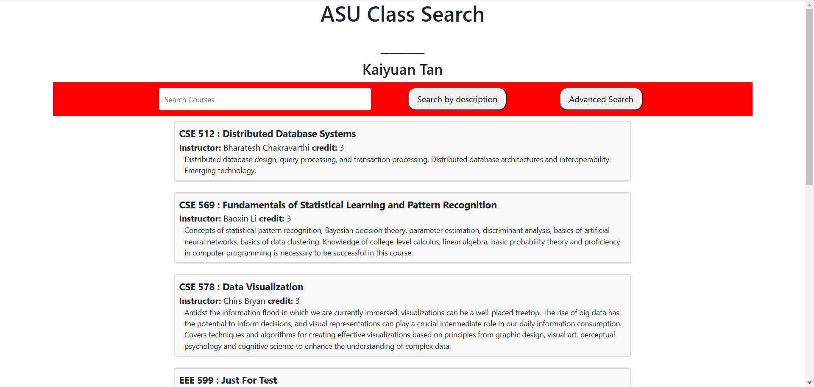

# ASU Class Search

An application for searching classes in ASU. Built with Elasticsearch for database, Flask for backend, Web programming(HTML5, JavaScript, CSS) for frontend.

``

## Major Functions
- Semantic search —— Search courses based on user's description.
- Advanced search —— Search for content by filtering on criteria (includes subject, code, title, instructor).

## Technologies Used
- Backend: Python, Flask
- Database: Elasticsearch
- Frontend: Html5, JavaScript, CSS

## Set up

### Prerequisites

- Python
- Elasticsearch
### Step 1: Clone this from git
  ```bash
  git clone https://github.com/Kaiyuan-Tan/CSE-512-bonus-point.git
  ```
### Step 2: Set up Elastic cloud and config
Once you get your elastic cloud id and api key, go to config.yaml and replace them. 
   ```bash
   cloud_id: "<YOUR ELASTIC CLOUD ID>"
   api_key: "<YOUR ELASTIC CLOUD API KEY>"
   url: "<YOUR DATASET URL IN JSON>"
   ```
### Step 3: Start the server
   ```bash
   python start.py
   ```
### Step 4: Visit your web search interface

Running on: [http://localhost:31002](http://127.0.0.1:31002)

## Try my demo!
[http://121.41.33.45:31002](http://121.41.33.45:31002/)

